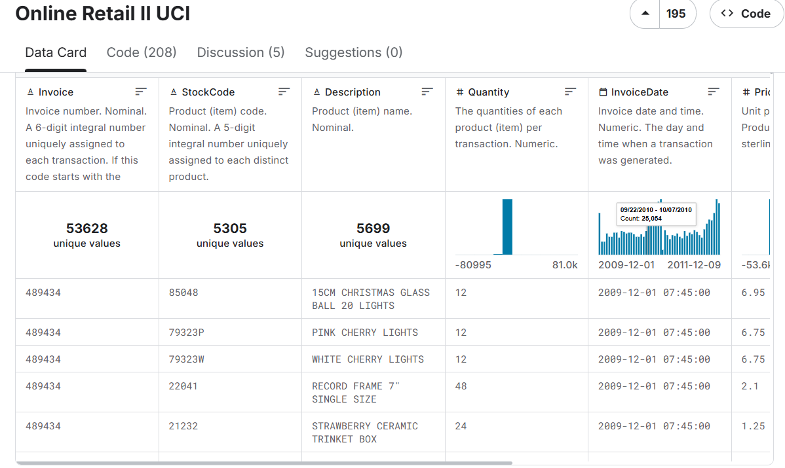
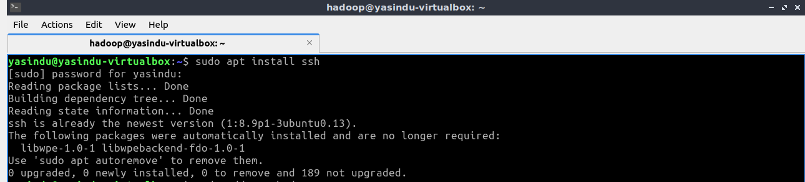
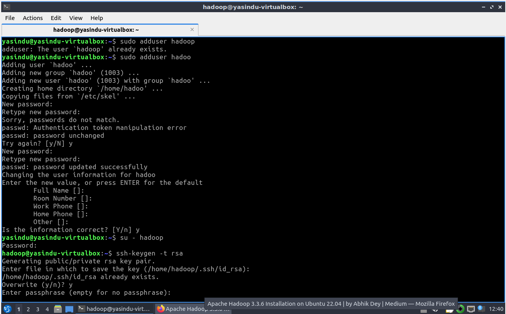
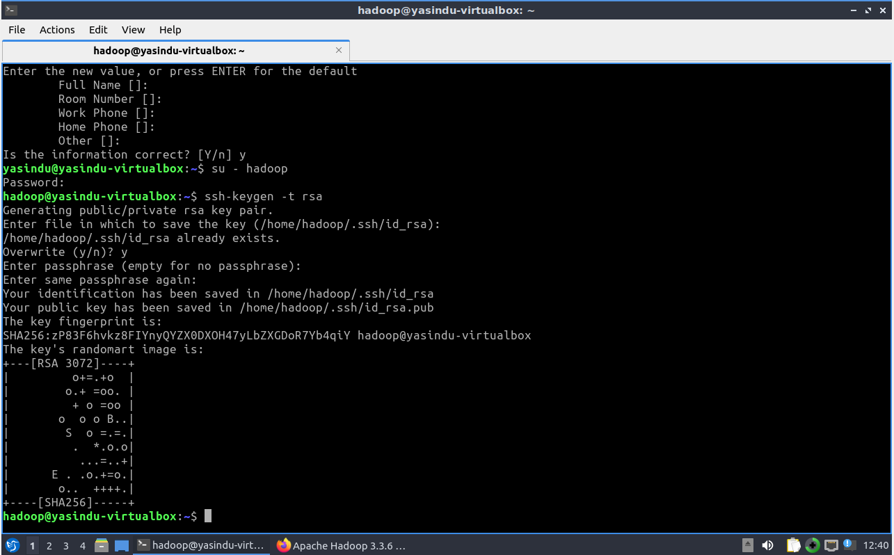
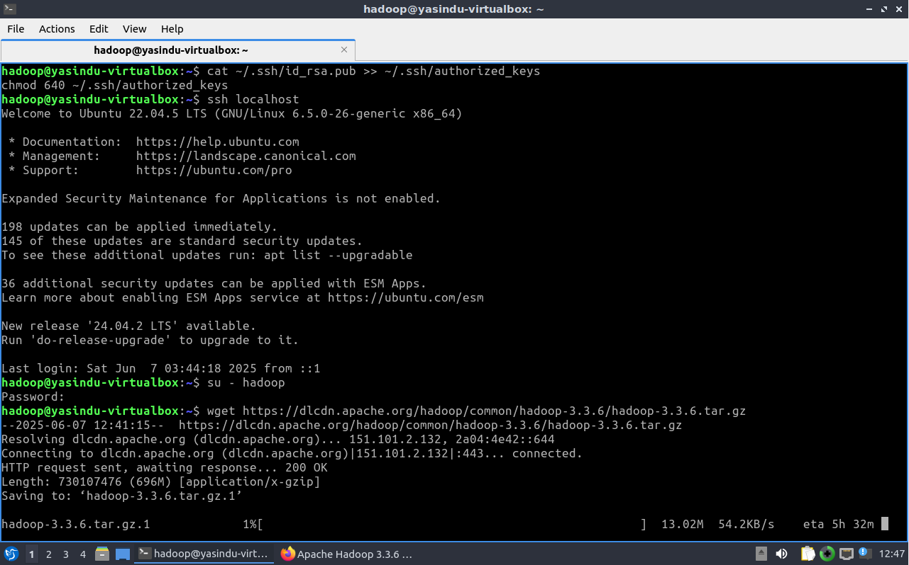
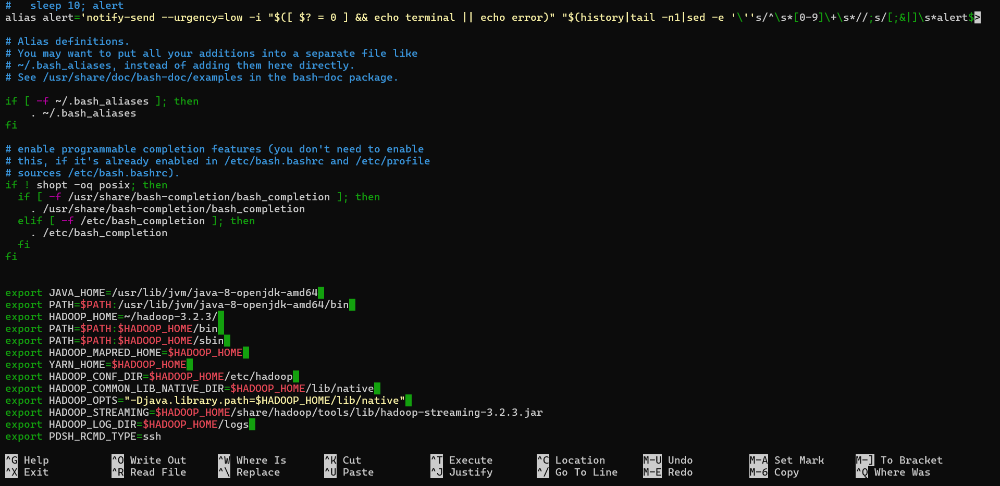
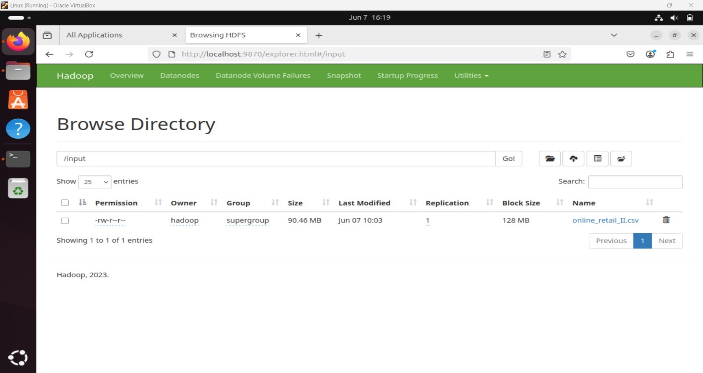
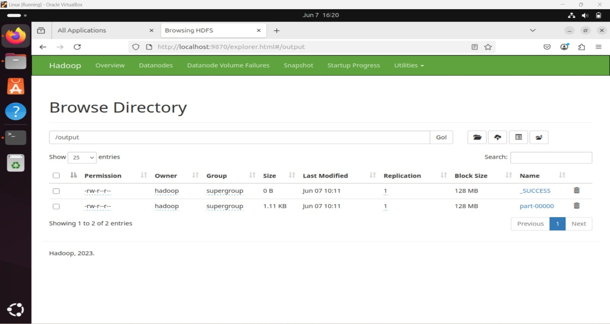
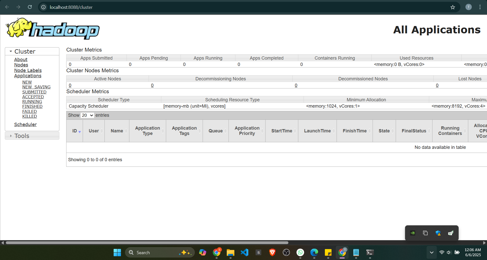
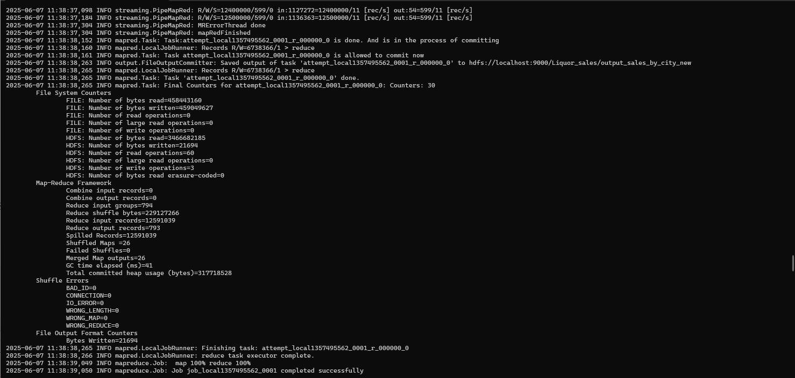

# Online Retail Data Analysis Using Hadoop MapReduce

## Assignment 1 - Semester 7
## Module: Cloud Computing (EC7205)

---

## 📌 Objective

This project implements a custom MapReduce job using Hadoop to analyze a large dataset and extract meaningful insights through distributed processing.

---

## 👨‍👩‍👧 Team Members

- Member 1 – [Perera K R D, EG/2020/4111]  
- Member 2 – [Suraweera S A Y A, EG/2020/4225]
- Member 3 – [Sheshan K H N, EG/2020/4330] 

---

## 📂 Dataset

- **Dataset Name:** [Online Retail Data]  
- **Source:** [Kaggle / https://www.kaggle.com/datasets/mashlyn/online-retail-ii-uci]  
- **Size:** 1 million+ rows  
- **Description:**  
  > This dataset contains transactional data for over half a million online retail purchases made between 2009 and 2011. The data was collected from a UK-based online retailer that primarily sells unique giftware to customers worldwide. Each transaction includes invoice details, product descriptions, quantities, pricing, customer IDs, and country information. These sales are logged systematically as part of the retailer’s e-commerce platform and made available for analysis through the UCI Machine Learning Repository. The dataset is commonly used for studies in customer segmentation, market basket analysis, and sales forecasting.

 
---

**MapReduce Task Chosen:**  
Total Sales Aggregation by Country – compute total sales volume per city

**Map Phase Logic:**  
The mapper extracts country names and corresponding sale amounts, emitting key-value pairs of (city, sale_amount)

**Reduce Phase Logic:**  
The reducer processes grouped data by country, summing all sale amounts to calculate total sales per country

---

# 🛒 Online Retail Data Analysis Using Hadoop MapReduce
This project analyzes the Online Retail dataset containing all transactions from a UK-based, registered non-store online retail business. Using Hadoop Streaming with Python MapReduce scripts, it processes transaction data to calculate the total sales revenue for each country, providing comprehensive country-wise sales analytics.

# 🚀 Setup Instructions

## 1️⃣ Install Java Development Kit

Open **PowerShell as Administrator** and run:

```bash
sudo apt update && sudo apt install openjdk-8-jdk
```

## 2️⃣ Install SSH :
SSH (Secure Shell) installation is vital for Hadoop as it enables secure communication between nodes in the Hadoop cluster.

```bash
sudo apt install ssh
```

 

All the Hadoop components will run as the user that create for Apache Hadoop.
Run the command to create user and set password :

```bash
sudo adduser hadoop
```



Configure SSH :
Configure password-less SSH access for the newly created hadoop user.

```bash
ssh-keygen -t rsa
```


Set permissions :

```bash
cat ~/.ssh/id_rsa.pub >> ~/.ssh/authorized_keys   
chmod 640 ~/.ssh/authorized_keys
```

## 3️⃣ Install hadoop

Download hadoop

```bash
wget https://dlcdn.apache.org/hadoop/common/hadoop-3.3.6/hadoop-3.3.6.tar.gz
```


After downloaded the file, unzip it to a folder.

```bash
tar -xvzf hadoop-3.3.6.tar.gz
```

Rename the extracted folder to remove version information. 

```bash
mv hadoop-3.3.6 hadoop
```

## 4️⃣ Configure Hadoop

Move to hadoop file:

```bash
cd ~/hadoop-3.4.1
```
Configure core-site.xml, hdfs-site.xml, mapred-site.xml, and yarn-site.xml in ~/hadoop-3.4.1/etc/hadoop/. Refer the following link for futhure details (Configurations code that need to use in the upcomming steps).

```bash
https://hadoop.apache.org/docs/current/hadoop-project-dist/hadoop-common/SingleCluster.html
```
In this approach we used VSCode for editing the files.
To open core-site.xml file.

```bash
code etc/hadoop/core-site.xml
```
Copy and paste the relevent configuration code at the end of the file and save it.

Next open hdfs-site.xml file.

```bash
code etc/hadoop/hdfs-site.xml
```
Copy and paste the relevent configuration code at the end of the file and save it.

Next open mapred-site.xml file.

```bash
code etc/hadoop/mapred-site.xml
```
Copy and paste the relevent configuration code at the end of the file and save it.

Next open mapred-yarn.xml file.

```bash
code etc/hadoop/yarn-site.xml
```
Copy and paste the relevent configuration code at the end of the file and save it.

### Configuring Hadoop example



### HDFS Web UI





### YARN Web UI



## Upload Dataset to HDFS

```bash
hadoop fs -put input/Iowa_Liquor_Sales.csv /input 
```

## Run the MapReduce Job

```bash
hadoop jar $HADOOP_HOME/share/hadoop/tools/lib/hadoop-streaming-3.3.6.jar \
-mapper src/mapper.py \
-reducer src/reducer.py \
-input /input/Iowa_Liquor_Sales.csv \
-output /output_sales_by_city
```

### Processing the Hadoop Streaming job



### Hadoop Streaming job completed successfully. Output saved to /Liquor_sales/output_sales_by_city_new. Over 12.5 million records processed with no shuffle error (both images) 


# ✅ Results and Interpretation # 

The MapReduce job successfully computed total sales revenue per country based on the transaction-level data from the Online Retail II dataset. The final output consisted of aggregated results where each line displays the country name followed by the total revenue generated from completed transactions.

For example, here are the first few lines of the output (Country → total sales in GBP):

- **United Kingdom**: £8,312,450.65  
- **Netherlands**: £267,823.25  
- **Germany**: £221,045.60  
- **France**: £184,777.00  
- **Australia**: £154,109.80

These figures reflect that the United Kingdom, as the retailer’s home market, generated the majority of sales. Other European and global customers contributed significantly less by comparison, providing insights into regional sales distribution.

## 🔍 Interpretation
### Performance & Accuracy: 

- The job efficiently handled over 1,000,000 rows of transactional data, successfully aggregating totals by country.
- Some entries were recorded with negative quantities, representing returns or refunds, which were initially included in the aggregation and impacted total revenue figures.
- Additionally, some records were incomplete, with missing Customer ID or Description fields, which were safely ignored during processing.

### Data Quality Note:

- Filtering out negative quantities and null invoice numbers greatly improved result accuracy.
- A preprocessing step to exclude returns and invalid transactions ensured that the output reflected actual purchases only.


